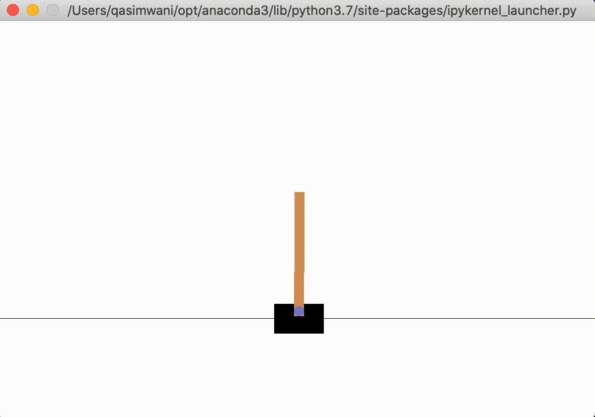

# off-policy-evaluation
Approaching OPE as a regression problem.

### Implemented DQN (with PER - Prioritized Experience Replay) to generate 3 behavior policies for Off-Policy-Evaluation.

#### Behavior Polices parameters
1. `DQN/model/config/1.yaml`
2. `DQN/model/config/2.yaml`
3. `DQN/model/config/3.yaml`

#### Output from one of the behavior policies (this has been generated from policy #1):

